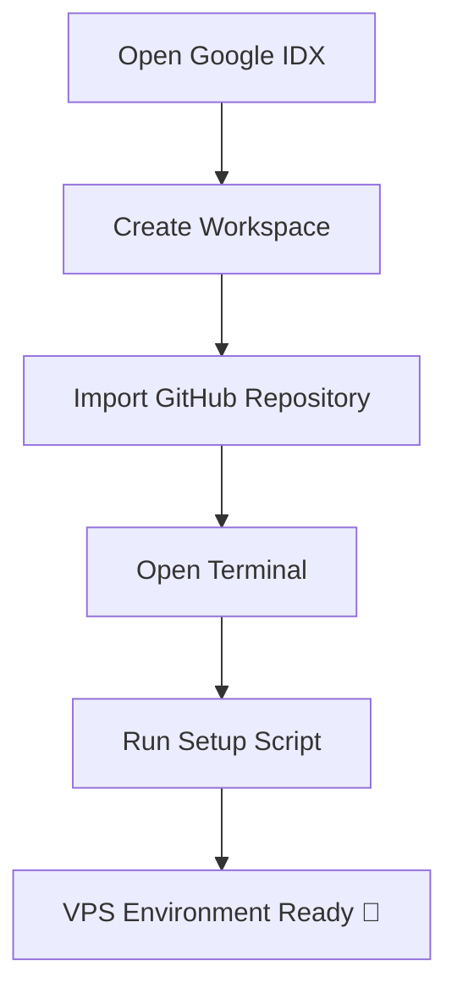

<h1 align="center">🚀 STW VPS</h1>

<h3 align="center">
Run a Powerful Linux VPS inside <b>Google IDX</b> in Seconds ⚡
</h3>

<p align="center">


</p>

---

# 🌟 Introduction

**STW VPS** converts your **Google IDX workspace** into a **temporary Linux VPS environment** using a single automated setup script.

Instead of configuring servers manually, this project allows developers to launch a ready-to-use Linux environment **instantly in the cloud**.

💡 Ideal for:

* Developers
* Script testing
* Automation
* Running bots
* Experimenting with Linux environments

All setup is **fully automated** and runs inside your browser.

---

# ⚡ Key Highlights

✨ One-Command VPS Setup
⚡ Instant Cloud Linux Environment
🖥️ Runs Fully in Browser
🔧 Automated Configuration
🚀 Fast Deployment
📦 Lightweight Script
🌐 No VPS Purchase Required

---

# 🧠 How It Works

```
           Google IDX
                │
                ▼
     Import STW VPS Repository
                │
                ▼
         Run Setup Script
                │
                ▼
      Fully Configured VPS
```

---

# 🖥️ Step 1 — Open Google IDX

Visit the official platform:

```
https://studio.firebase.google.com
```

Login using your **Google Account**.

---

# 📂 Step 2 — Create Workspace

Create a new workspace using this repository:

```
https://github.com/stwanubhav/stw_vps
```

⚠️ **Important**

Do **NOT rename the repository** during workspace creation.

---

# ⚙️ Step 3 — Start VPS Setup

Open the **IDX Terminal** and execute the command below:

```bash
bash <(curl -fsSL https://raw.githubusercontent.com/stwanubhav/idx-git-vps/main/vps.sh)
```

The script will automatically configure the environment.

---

# 🔄 Setup Process

During execution, the script will perform:

| Step | Process                   |
| ---- | ------------------------- |
| 1    | System Update             |
| 2    | Dependency Installation   |
| 3    | Environment Configuration |
| 4    | VPS Runtime Preparation   |
| 5    | Final Setup Completion    |

Everything runs automatically.

---

# 📊 Workflow



---

# 💡 What You Can Do With This

Using this VPS environment you can:

🤖 Run **Telegram Bots**
🌐 Host **Small Web Projects**
⚙️ Test **Automation Scripts**
🧪 Practice **Linux Commands**
🖥️ Run **Development Servers**

---

# 📦 Repository

GitHub Repository:

```
https://github.com/stwanubhav/stw_vps
```

---

# ⚠️ Important Notes

* This environment runs inside the **Google IDX sandbox**
* Workspace data may reset if deleted
* Designed mainly for **development and testing**

---

# 👨‍💻 Developer

### Anubhav

GitHub
https://github.com/stwanubhav

---

# ⭐ Support

If you like this project:

⭐ **Star the repository**
🍴 **Fork the project**
📢 **Share with developers**

---

<p align="center">

💙 Made with passion for developers

</p>
